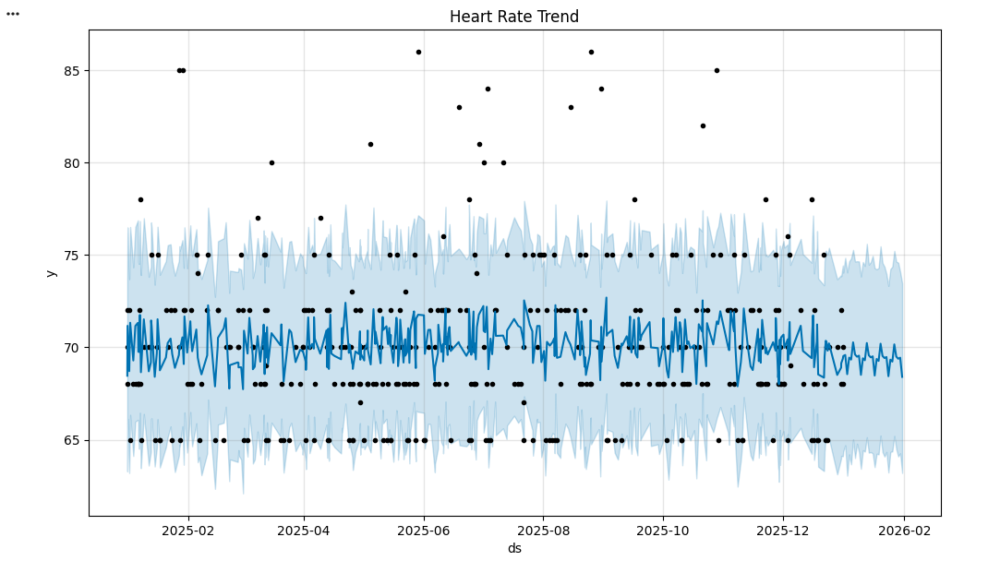
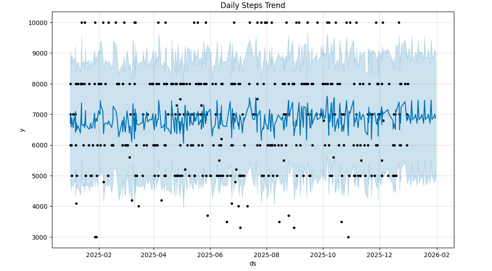
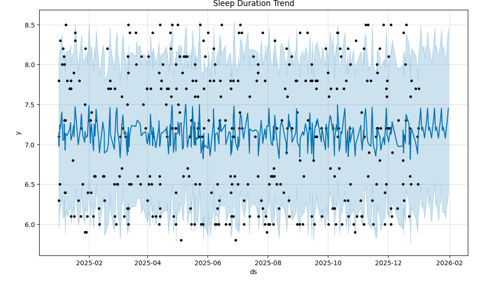
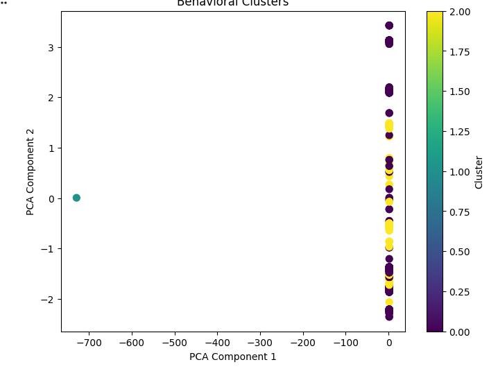

# Milestone 2: Feature Extraction and Modeling

## Objective  
The aim of this milestone is to extract meaningful features from fitness data, model temporal trends using Prophet, and identify behavioral patterns using clustering. This sets the foundation for anomaly detection in future milestones.

---

## Dataset Description  
- **Dataset file:** `data/Clean.csv`  
- **Key columns used:**  
  - Time‑series: `Heart Rate`, `Daily Steps`, `Sleep Duration`  
  - Demographic & behavioral: `Age`, `BMI Category`, `Stress Level`, `Physical Activity Level`  
  - `Timestamp` used as the time index for trend modeling.

---

## Steps Performed

### 1. Feature Extraction  
- Extracted statistical features (mean, standard deviation, skewness, kurtosis).  
- Extracted automated time‑series features using **TSFresh** for Heart Rate, Steps, and Sleep.

### 2. Trend Modeling  
- Used **Facebook Prophet** to model and forecast Heart Rate, Steps, and Sleep trends over time.  
- Computed expected trends with confidence intervals.

### 3. Behavioral Clustering  
- Combined features from TSFresh and demographic/activity columns.  
- Encoded categorical data and handled missing values.  
- Scaled features and applied **KMeans clustering**.  
- Visualized clusters with PCA.

---

## Tools and Libraries Used  
- Python 3.x  
- `pandas`, `numpy`  
- `tsfresh`  
- `prophet`  
- `scikit‑learn`  
- `matplotlib`

---

## Visual Outputs

### Heart Rate Trend  

### Daily Steps Trend  

### Sleep Duration Trend  

### Behavioral Clusters  

---

## Folder Structure

Milestone2/
├── feature_extraction.py
├── modeling.py
├── requirements.txt
├── README.md
├── data/
│ └── Clean.csv
└── images/
├── hr_trend.png
├── steps_trend.png
├── sleep_trend.png
└── clusters.png
